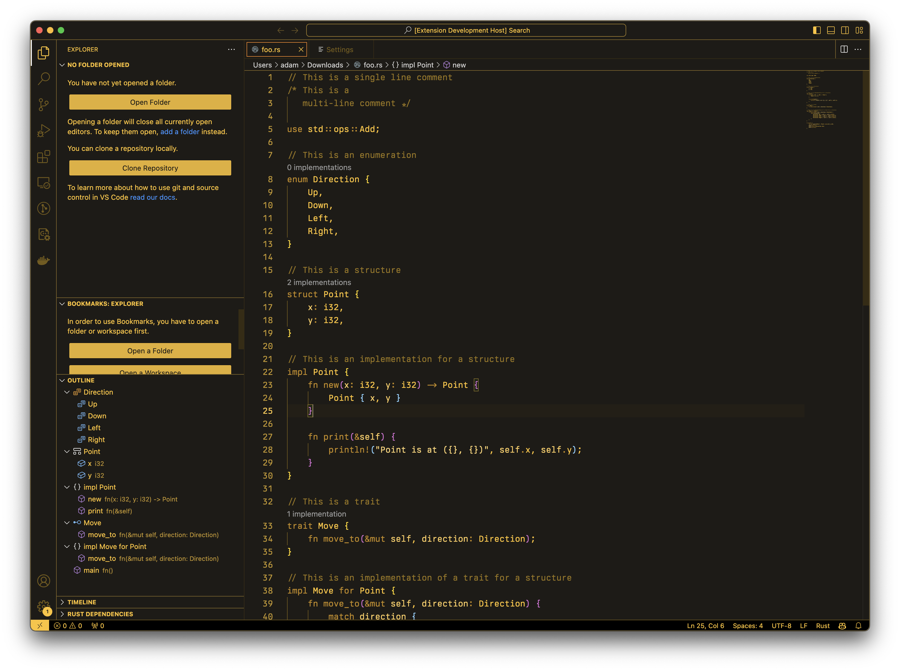

# Amber Gas Plasma VSCode Theme

The warm amber glow of a gas plasma display, brought directly to your VSCode window. Kind of. Space heater functionality not included.



## Use
1. Clone the repo
2. Enter the repo directory
3. Package the extension
    ```bash
    vsce package
    ```
4. Install (replace the `x.x.x` in the snippet with the current version)
    ```bash
    code --install-extension amber-gas-plasma-x.x.x.vsix
    ```

## Other
Note: Colors are pretty much "eyeballed" at the moment.
